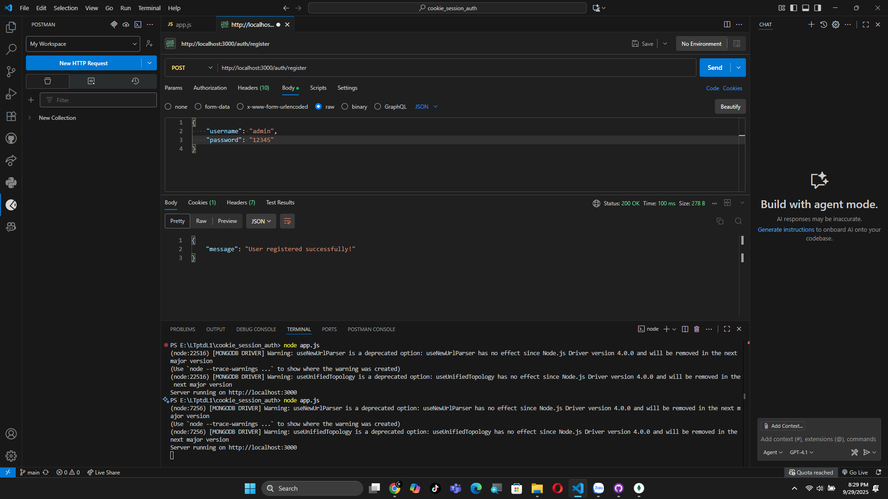
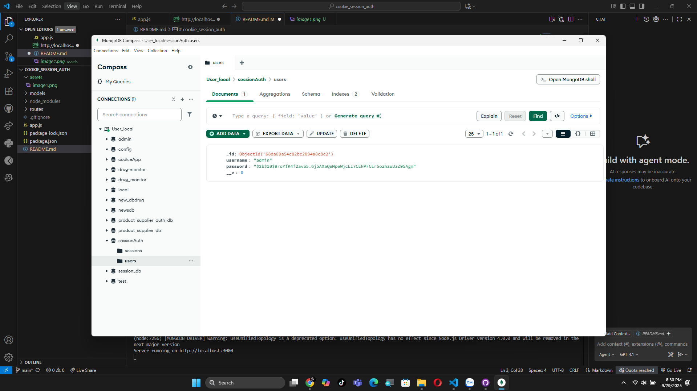
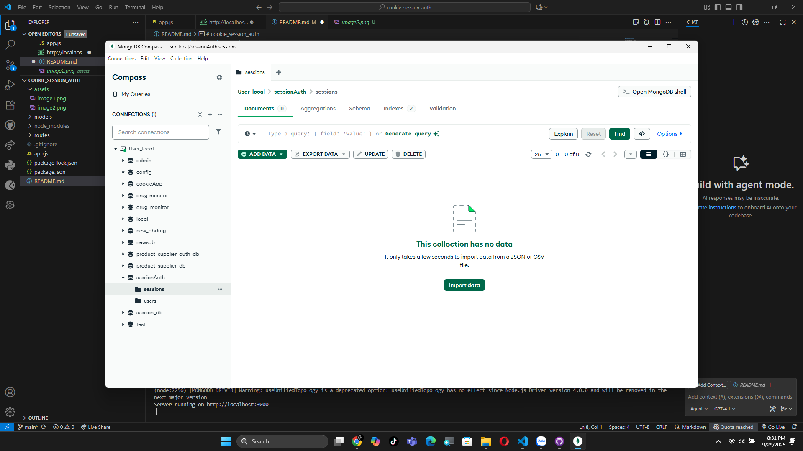
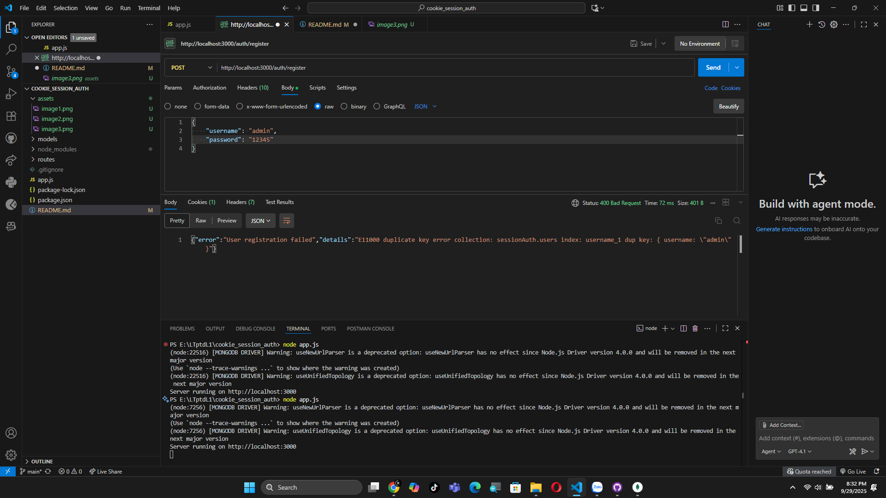
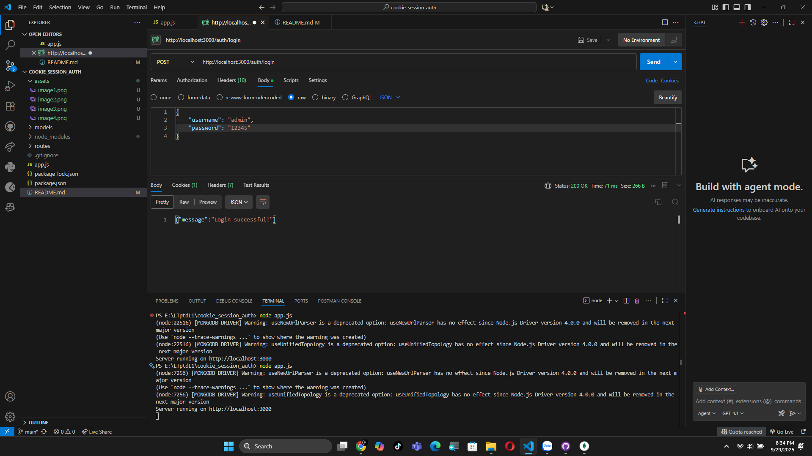
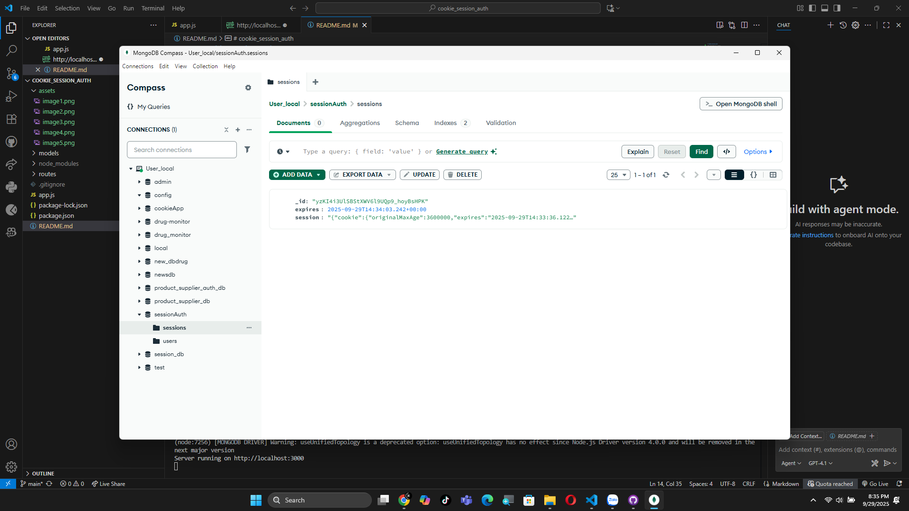
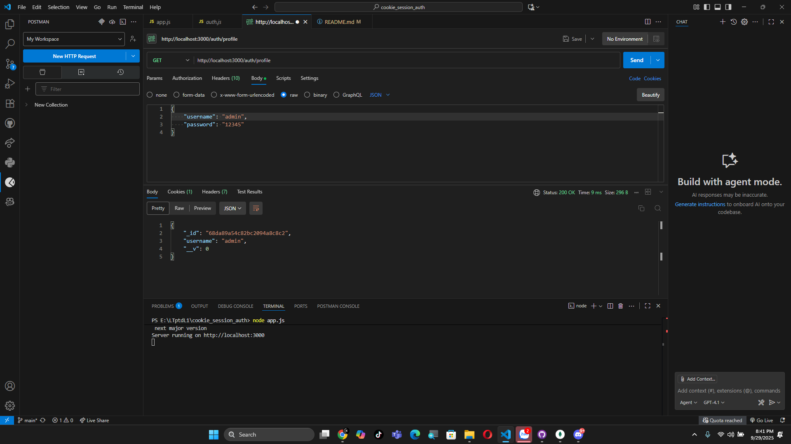
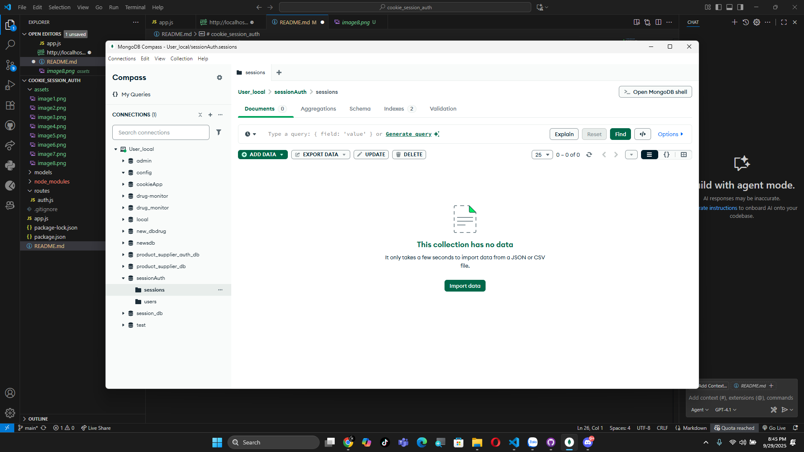

# 🍪 Cookie Session Auth

---

## 📑 Quy trình demo

### 📝 Đăng ký tài khoản
- Người dùng thực hiện đăng ký:  
  

### 🗄️ Kiểm tra CSDL
- Bảng **Users** sau khi tạo tài khoản:  
  

- Bảng **Sessions** sau khi đăng ký:  
  

### ⚠️ Đăng ký trùng lặp
- Hệ thống từ chối khi tài khoản đã tồn tại:  
  

---

### 🔑 Đăng nhập
- Người dùng đăng nhập thành công:  
  

### 🗄️ Kiểm tra Session trong CSDL
- Session mới được thêm vào bảng **Sessions**:  
  

---

### 👤 Xem profile
- Sau khi đăng nhập, người dùng có thể xem thông tin profile:  
  

---

### 🚪 Logout
- Người dùng logout khỏi hệ thống:  
  

### 🗄️ Kiểm tra CSDL sau khi logout
- Session đã được xóa khỏi bảng **Sessions**:  
  

---

✍️ *Demo phục vụ học tập về cơ chế Cookie-Session Authentication.*
